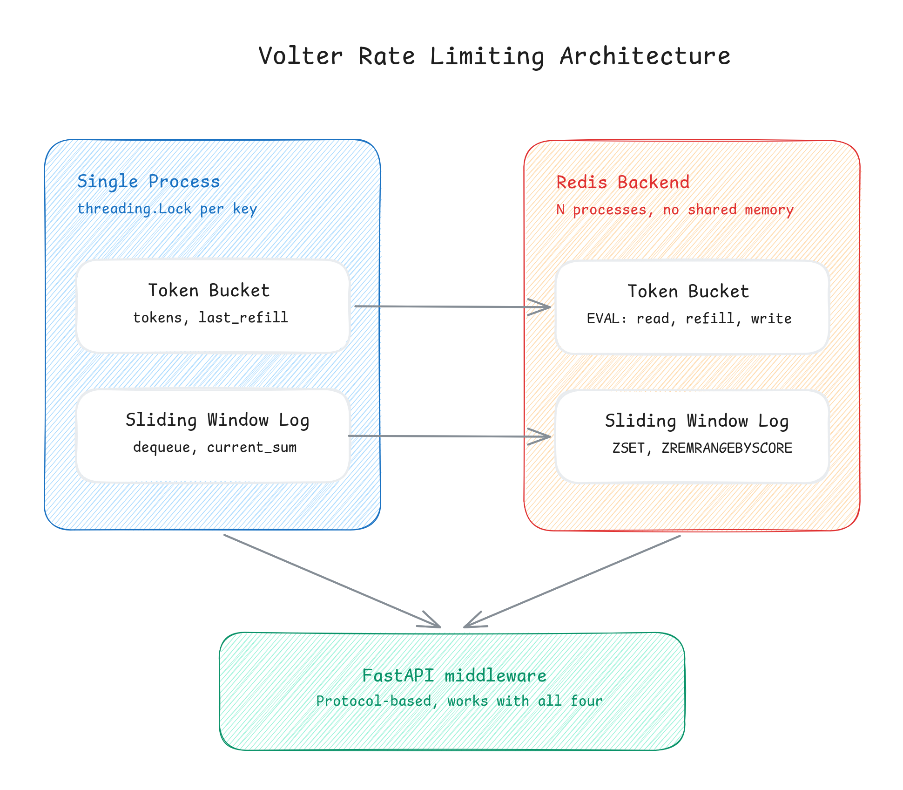

# volter

[](https://pypi.org/project/volter/)
[](https://img.shields.io/pypi/pyversions/volter.svg)
[](https://opensource.org/licenses/MIT)

A high-performance, production-grade rate limiting library for Python. Volter implements **Token Bucket** and **Sliding Window Log** algorithms with thread-safe in-memory backends and distributed Redis backends. It also ships with drop-in FastAPI middleware.

```python
from volter import TokenBucketLimiter

# Initialize a limiter: 10 burst capacity, refills at 1 token/sec
limiter = TokenBucketLimiter(capacity=10, refill_rate=1.0)

if limiter.allow("user:123"):
    process_request()
else:
    reject_with_429()
```

Most rate limiter tutorials stop at a single, basic algorithm running in a single process. Volter provides production-ready implementations of multiple algorithms with genuinely different tradeoffs. It explicitly addresses concurrency race conditions—from in-process thread-safety to multi-process correctness across distributed app servers.

[Quick Start](#quick-start) • [Architecture & Design](#architecture--design) • [API Reference](#api-reference) • [Engineering Highlights (Why Volter?)](#engineering-highlights) • [Development & Testing](#development--testing)

## Key Features

- **Zero Third-Party Dependencies** in the core package (`TokenBucketLimiter`, `SlidingWindowLimiter`).
- **Amortized $O(1)$ Sliding Window Log** performance utilizing a running total approach.
- **Lock-Free Read Paths** for established keys using thread-safe double-checked locking in-memory.
- **Distributed Multi-Process Safety** utilizing atomic Redis Lua scripts.
- **Clock Drift Resilience** via `time.monotonic()` and Redis server-side `TIME` commands.
- **FastAPI Middleware** that conforms to Python `Protocol` typing, working out-of-the-box with any limiter backend.

## Installation

Install only what you need. Core limiters have **zero dependencies**. The `redis` and `fastapi` extras are loaded lazily, so you never pull in libraries you do not use.

```bash
# Core only: In-memory limiters (zero dependencies)
pip install volter

# In-memory + Redis-backed limiters
pip install volter[redis]

# In-memory + FastAPI middleware
pip install volter[fastapi]

# Full suite: In-memory, Redis, and FastAPI middleware
pip install volter[redis,fastapi]
```

## Quick Start

### 1. In-Memory Rate Limiting (Single-Instance, Thread-Safe)

```python
from volter import TokenBucketLimiter, SlidingWindowLimiter

# Token Bucket: Best for smoothing steady traffic with short burst capacity
# Allows bursts of up to 10 requests, refilling at 1 token per second
bucket = TokenBucketLimiter(capacity=10, refill_rate=1.0)

# Sliding Window Log: Best for strict interval counts (e.g., max 100 requests per minute)
window = SlidingWindowLimiter(capacity=100, window_size=60.0)

# Evaluate if a request should be processed
if bucket.allow("client_ip_or_user_id"):
    # Process request...
    pass
```

### 2. Redis-Backed Rate Limiting (Distributed, Multi-Process)

```python
import redis
from volter.redis_token_bucket import RedisTokenBucketLimiter
from volter.redis_sliding_window import RedisSlidingWindowLimiter

r = redis.Redis(host="localhost", port=6379, decode_responses=True)

# Token Bucket sharing state across multiple web-server processes
bucket = RedisTokenBucketLimiter(redis_client=r, capacity=100, refill_rate=10.0)

# Sliding Window Log sharing state across multiple web-server processes
window = RedisSlidingWindowLimiter(redis_client=r, capacity=100, window_size=60.0)
```

### 3. FastAPI Middleware

Add rate limiting to your entire FastAPI application in three lines of code:

```python
from fastapi import FastAPI
from volter import TokenBucketLimiter
from volter.fastapi_middleware import RateLimitMiddleware

app = FastAPI()
limiter = TokenBucketLimiter(capacity=5, refill_rate=1.0)

# Out-of-the-box middleware (rejects with a 429 status code and 'Retry-After: 1' header)
app.add_middleware(RateLimitMiddleware, limiter=limiter)
```

You can customize the rate limit key (e.g., using an API key or route instead of client IP) using a custom `key_func`:

```python
app.add_middleware(
    RateLimitMiddleware,
    limiter=limiter,
    key_func=lambda request: request.headers.get("X-API-Key", "anonymous"),
)
```

## Architecture & Design

Volter is designed with performance, correctness, and low resource overhead in mind.



### 1. Fine-Grained Key Locking (In-Memory)

Instead of protecting the entire limiter database with a single global lock—which would serialize all incoming API requests and severely bottle-neck throughput—Volter uses **two-level locking**:

- A global dictionary-level lock (`_buckets_lock` / `_logs_lock`) is used **only** when initializing a state tracker for a new key.
- A **double-checked locking** pattern is used: if the key already exists, we retrieve it lock-free. We only acquire the global lock if the key is absent.
- A fine-grained, per-key lock (`bucket.lock` / `log.lock`) is acquired to perform the read-compute-write sequence for that specific user.

Thus, concurrent requests for `user:123` never block concurrent requests for `user:456`.

### 2. Amortized $O(1)$ Sliding Window Log

A naive sliding window log recalculates the active count on every request by iterating over the entire queue of timestamps—an $O(N)$ operation where $O(N)$ is the number of requests in the window.

Volter optimizes this to **amortized $O(1)$** by maintaining a running sum (`current_sum`) for each key. When a request arrives, we evict only the expired records from the front of the queue and decrement our running total accordingly. Each evaluation is $O(k)$ where $k$ is the number of expired entries in that tick, resulting in an amortized $O(1)$ operational cost.

### 3. Clock-Drift and VM-Pause Protection

- **In-Memory**: Standard clock mechanisms like `time.time()` represent wall-clock time and can jump backward or forward (due to NTP syncs, VM suspends, or manual clock alterations), breaking rate-limiting math. Volter exclusively uses `time.monotonic()` in-memory, ensuring elapsed time calculations are guaranteed to be forward-only.
- **Distributed (Redis)**: Different application servers can suffer from clock skew relative to each other. To avoid this, Volter's Redis scripts call Redis's own `TIME` command to retrieve the central Redis clock timestamp, neutralizing clock-skew issues completely.

## API Reference

### In-Memory Limiters

#### `TokenBucketLimiter`

_Implements the Token Bucket algorithm. Best for most APIs. Allows a burst of up to `capacity` requests, smooths down to a steady rate of `refill_rate` per second._

- **Constructor**:
    ```python
    TokenBucketLimiter(capacity: int, refill_rate: float, max_idle: float = 0.0)
    ```
    - `capacity`: Maximum number of tokens the bucket can hold.
    - `refill_rate`: How many tokens are added to the bucket per second.
    - `max_idle`: How long (in seconds) a key can go untouched before its internal state is evicted from memory to save space. Defaults to `(capacity / refill_rate) * 2`.
- **Methods**:
    - `allow(key: str, tokens_requested: float = 1.0) -> bool`: Returns `True` if the bucket contains at least `tokens_requested` tokens. If so, consumes them.

#### `SlidingWindowLimiter`

_Implements the Sliding Window Log algorithm. Best for precise limit enforcement over strict intervals._

- **Constructor**:
    ```python
    SlidingWindowLimiter(capacity: int, window_size: float, max_idle: float = 0.0)
    ```
    - `capacity`: Total allowed weighted units inside the sliding window.
    - `window_size`: The duration of the sliding window in seconds.
    - `max_idle`: How long (in seconds) a key can remain idle before eviction. Defaults to `window_size * 2`.
- **Methods**:
    - `allow(key: str, tokens_requested: float = 1.0) -> bool`: Returns `True` if adding `tokens_requested` keeps the total weight within `capacity` for the sliding window.

### Redis-Backed Limiters

#### `RedisTokenBucketLimiter`

_Distributed Token Bucket. Utilizes a Redis hash storing `tokens` and `last_refill` attributes._

- **Constructor**:
    ```python
    RedisTokenBucketLimiter(redis_client: redis.Redis, capacity: int, refill_rate: float, ttl: int = 3600, key_prefix: str = "volter:tb")
    ```
    - `redis_client`: A `redis-py` client instance.
    - `capacity`: Maximum capacity of the token bucket.
    - `refill_rate`: Refill rate in tokens per second.
    - `ttl`: Time-to-live in seconds for idle keys. Enables automated self-cleanup of stale keys in Redis.
    - `key_prefix`: Prefix added to keys inside Redis to avoid namespace collisions.
- **Methods**:
    - `allow(key: str, tokens_requested: float = 1.0) -> bool`: Atomic check-and-consume via evaluated server-side Lua script.

#### `RedisSlidingWindowLimiter`

_Distributed Sliding Window. Utilizes a Redis Sorted Set (ZSET) where elements represent individual requests._

- **Constructor**:
    ```python
    RedisSlidingWindowLimiter(redis_client: redis.Redis, capacity: int, window_size: float, ttl: int | None = None, key_prefix: str = "volter:sw")
    ```
    - `redis_client`: A `redis-py` client instance.
    - `capacity`: Exact request capacity allowed inside the window.
    - `window_size`: Size of the sliding window in seconds.
    - `ttl`: Redis key TTL. Defaults to `int(window_size) + 1`.
    - `key_prefix`: Redis key prefix.
- **Methods**:
    - `allow(key: str) -> bool`: Atomic sliding-window calculation using a Redis Sorted Set.

### FastAPI Middleware

#### `RateLimitMiddleware`

_An ASGI middleware designed to catch and enforce rate limits globally or on a custom key basis._

- **Constructor**:
    ```python
    RateLimitMiddleware(app: ASGIApp, limiter: _Limiter, key_func: Callable[[Request], str] = _default_key_func, tokens_requested: float = 1.0)
    ```
    - `app`: The ASGI application instance.
    - `limiter`: Any rate limiter implementation conforming to the `_Limiter` protocol (must implement `allow(key: str, tokens_requested: float) -> bool`).
    - `key_func`: A callable accepting a FastAPI `Request` and returning a `str` used as the rate-limiting key. Defaults to returning the client's host IP.
    - `tokens_requested`: The default weight/token cost applied to requests intercepted by this middleware.

## Engineering Highlights

This library was built with a deep understanding of standard distributed system failures, concurrency issues, and efficiency optimizations.

### 1. Atomic Lua Scripting vs. Optimistic Locking

In a distributed setup with multiple application servers, rate limiting requires atomicity. A naive implementation using a sequence of commands (e.g., `GET` -> compute -> `SET`) creates a classic **check-then-act race condition** where concurrent processes read stale states and bypass limits.

Volter solves this by packaging the logic inside **indivisible Lua scripts** executed on the Redis server:

- Since Redis is single-threaded, a Lua script runs completely uninterrupted as a single command, neutralizing race conditions without requiring global distributed locks.
- We chose Lua scripts over standard `MULTI/EXEC` pipelines because `MULTI/EXEC` cannot branch mid-transaction based on read results without utilizing expensive optimistic locking retry loops (`WATCH` commands).

### 2. High-Performance Redis Sorted Set Collisions Bypass

In the `RedisSlidingWindowLimiter`, we store requests inside a Redis sorted set (ZSET). Redis ZSETs require members to be unique.

- If we stored raw timestamps as the ZSET members, two concurrent requests arriving within the exact same microsecond would collision, overwriting each other and leading to an undercount (allowing clients to bypass limits).
- Volter solves this by generating a unique UUID4 in Python for each request and storing the UUID as the member, while the epoch timestamp is stored as the ZSET score. This ensures every single request occupies a distinct node in Redis's skip-list.
- **Why generate UUIDs in Python instead of inside Lua?** Redis replication requires Lua scripts to be strictly deterministic. Using random-number or UUID generators inside a Lua script is restricted as it breaks replication safety. Generating the UUID in Python keeps the Lua script deterministic and replication-safe.

### 3. Comprehensive Verification (True Multi-Process Integration Tests)

To guarantee that the concurrency safety mechanisms are production-ready, Volter avoids testing concurrency purely with greenlets or thread-pools.

Our Redis integration tests spin up true operating-system processes (`multiprocessing.Process`), each holding its own independent Redis connection. These processes hammer the Redis-backed limiters concurrently. The test suite asserts that the exact specified capacity limit is enforced to the single request, validating Volter's thread/process safety guarantees in high-concurrency environments.

## Known Limitations & Roadmap

- **Passive In-Memory Eviction**: Memory cleanup is done on-demand during subsequent calls to `.allow()`. If a key becomes completely idle and is never called again, it remains in memory until a sweep is triggered. A proactive, background worker sweep is a planned enhancement.
- **Static Retry-After Header**: The FastAPI middleware currently returns a static `Retry-After: 1` header. Calculating and returning the exact millisecond-precision wait time for each algorithm is on the roadmap.
- **Weighted Requests for Redis Sliding Window**: The Redis sliding window currently counts requests with a static weight of $1$. Encoding weights inside ZSET members to support varying weights is a natural next step.

## Development & Testing

### 1. Setup Environment

Volter utilizes `uv` for modern, lightning-fast Python package and dependency management.

```bash
# Sync all virtual environment and dev dependencies
uv sync --all-extras
```

### 2. Running Tests

The test suite consists of unit tests, in-memory concurrency tests, and Redis integration tests.

```bash
# Run the full test suite
uv run pytest
```

To run the Redis-backed integration tests, you must have a local Redis instance running. You can easily boot one up using Docker:

```bash
# Launch local Redis
docker run -d --name volter-redis -p 6379:6379 redis:7-alpine

# Run the Redis tests
uv run pytest -v tests/test_redis_token_bucket.py tests/test_redis_sliding_window.py
```
